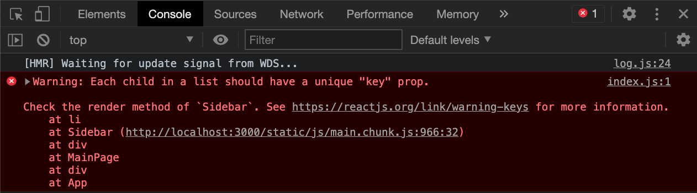

## Recipe App: Adding Props

For this lesson, we will take our Recipe App that we set up earlier and add **props** to our components. At the moment all of our category information and recipe information is hard-coded directly into our JSX. We will learn how we can store our category and recipe data at the top level and pass that data as **props** to the child components.


Let's return to our `App` component and we'll leave the `HomePage` component commented out for now so we are just viewing the main page.

```js
import Header from './components/Header';
// import HomePage from './pages/HomePage';
import MainPage from './pages/MainPage';
import './App.css';

function App() {
  return (
    <div className="App">
      <Header />
      {/* <HomePage /> */}
      <MainPage />
    </div>
  );
}

export default App;
```
In the browser, we should now see our main page showing our categories on the side and recipes towards the bottom.

The majority of our work for the rest of the lesson will be in the `MainPage` component. Our goal is to store our data for cateogies and recipes at the top level in our `MainPage` component and pass that data to the child components as **props** to be rendered to the page.

### Defining the Category and Recipe Data

Create a new file called `categoryData.js` in the `src` directory.

```bash
touch ./src/categoryData.js
```
<details>
  <summary>Copy and paste this code into the `catagoryData.js` file.</summary>

  ```js
const categoryData = [
  {
    categoryName: 'Breakfast',
    categoryDescription: 'Lorem ipsum dolor sit amet, consectetur adipisicing elit. Quis, eligendi. Repellendus voluptates vel, consequatur sequi dolorem repellat blanditiis aut optio impedit quidem ut officiis laudantium vitae dicta aspernatur ullam quis?',
    categoryImg: 'https://images.unsplash.com/photo-1533089860892-a7c6f0a88666',
    recipes: [
      {
        recipeName: 'Breakfast Potatoes',
        recipeDescription: 'Lorem ipsum dolor sit amet, consectetur adipisicing elit. Repellendus facere ab cumque autem ea deserunt est sit quasi in nihil quibusdam, quos, animi laborum voluptate doloribus ullam blanditiis ipsam ut!`'
      },
      {
        recipeName: 'French Toast',
        recipeDescription: 'Lorem ipsum dolor sit amet, consectetur adipisicing elit. Repellendus facere ab cumque autem ea deserunt est sit quasi in nihil quibusdam, quos, animi laborum voluptate doloribus ullam blanditiis ipsam ut!`'
      },
      {
        recipeName: 'Huevos Rancheros',
        recipeDescription: 'Lorem ipsum dolor sit amet, consectetur adipisicing elit. Repellendus facere ab cumque autem ea deserunt est sit quasi in nihil quibusdam, quos, animi laborum voluptate doloribus ullam blanditiis ipsam ut!`'
      },
    ]
  },
  {
    categoryName: 'Soups',
    categoryDescription: 'Lorem ipsum dolor sit amet, consectetur adipisicing elit. Quis, eligendi. Repellendus voluptates vel, consequatur sequi dolorem repellat blanditiis aut optio impedit quidem ut officiis laudantium vitae dicta aspernatur ullam quis?',
    categoryImg: 'https://images.unsplash.com/photo-1588566565463-180a5b2090d2',
    recipes: [
      {
        recipeName: 'Tomato Bisque',
        recipeDescription: 'Lorem ipsum dolor sit amet, consectetur adipisicing elit. Repellendus facere ab cumque autem ea deserunt est sit quasi in nihil quibusdam, quos, animi laborum voluptate doloribus ullam blanditiis ipsam ut!`'
      },
      {
        recipeName: 'Split Pea Soup',
        recipeDescription: 'Lorem ipsum dolor sit amet, consectetur adipisicing elit. Repellendus facere ab cumque autem ea deserunt est sit quasi in nihil quibusdam, quos, animi laborum voluptate doloribus ullam blanditiis ipsam ut!`'
      },
    ]
  },
  {
    categoryName: 'Pasta Dishes',
    categoryDescription: 'Lorem ipsum dolor sit amet, consectetur adipisicing elit. Quis, eligendi. Repellendus voluptates vel, consequatur sequi dolorem repellat blanditiis aut optio impedit quidem ut officiis laudantium vitae dicta aspernatur ullam quis?',
    categoryImg: 'https://images.unsplash.com/photo-1603729362753-f8162ac6c3df',
    recipes: [
      {
        recipeName: 'Stroganoff',
        recipeDescription: 'Lorem ipsum dolor sit amet, consectetur adipisicing elit. Repellendus facere ab cumque autem ea deserunt est sit quasi in nihil quibusdam, quos, animi laborum voluptate doloribus ullam blanditiis ipsam ut!`'
      }
    ]
  }
];

export default categoryData;
  ```
</details>

Take a moment to familiarize yourself with the data here. We have an array of category objects. Each object contains the name, and description for that category, and an array of recipes for that category. Our job is to take this data and to feed it as **props** to our components and have that information display on the page, just like we were able to do with our `Person` component from before.

Eventually this data will be coming from a database and we'll make a network request to get this data from our API. For now we'll work with this as a placeholder. Note that each category object is already "populated" with the recipe data.

### Passing Data as Props

Import `categoryData` into `MainPage.js` and log out `categoryData`. You should see your data logged in the console. After that, feel free to comment out your log message.

```js
import categoryData from '../categoryData';

console.log('categoryData =>', categoryData);
...
```

We'll start with our `Sidebar` component. Our eventual goal is to feed the `categoryData` to our `Sidebar` component and render out a list of category names, one for each category object in `categoryData`.

In `MainPage.js`, feed a `categories` **prop** to the `Sidebar` component passing in the `categoryData` variable.

```js
...

function MainPage() {
  return (
    <div className="main-page">
      <Sidebar categories={categoryData} />
      <main className="category-info">
        <CategoryDetail />
        <RecipesList />
      </main>
    </div>
  );
}

...
```

Here, `categoryData` is just a variable that holds our array of data. We are feeding that array of data as a prop that we've decided to call `categories`. It is important to note that `categories` is the name of the prop being passed. Inside of the `Sidebar` component we have access to `props.categories` not `props.categoryData`.

### Creating a List of Components

Let's make our way back to `Sidebar.js`. In the `Sidebar` component. We'll first pass props as a parameter to the `Sidebar` component and then log out **props**.

```js
function Sidebar(props) {
  console.log('props in Sidebar =>', props);

  return (
    <aside className="sidebar">
      <ul>
        <li className="sidebar-card">Breakfast</li>
        <li className="sidebar-card">Soups</li>
        <li className="sidebar-card">Pasta Dishes</li>
      </ul>
    </aside>
  );
}
...
```

Check the console and you should see your array of category data as a property of the props object!

## Creating an Array of JSX Elements

In the **JSX** for our `Sidebar` component we are hard coding that list of category names, "Breakfast", "Soups", and "Pasta Dishes". Our goal is to loop through the array of category data and render out one `<li>` for each category object, showing just the category name. We essiantially want to take our array of categories and get an array of `<li>`s; perfect for JavaScript's **map method**.

If we quickly look back `MainPage.js` we can see that the name of the **prop** we are passing to the `Sidebar` component is `categories`. This is the name we'll use to access the data inside of the `Sidebar` component.

Map over `props.categories` and create an array of `<li>`s with the `categoryName` inside the `<li>`. We only have access to props in the `Sidebar` function so we'll do our looping (mapping) in there.

```js
function Sidebar(props) {
  const categoriesList = props.categories.map((category) => {
    return (
      <li className="sidebar-card">
        {category.categoryName}
      </li>
    );
  });

  return (
    <aside className="sidebar">
      <ul>
        {categoriesList}
      </ul>
    </aside>
  );
}

export default Sidebar;
```

We are mapping through our array of category data (`props.categories`) and creating an array of `<li>`s. This array of `<li>`s gets stored in a variable we call `categoriesList`. We can then insert this `categoriesList` variable into the `<ul>` of our **JSX**.

Take a look at the browser. We should see our list of categories in the sidebar just as before! Now here comes the fun part. Go ahead and change one of the category names in `categoryData.js` and watch the content change on the page! Instead of hard coding the content we are dynamically populating from `categoryData.js`.

If you open up the developer console you'll also see this warning.



Note this is a warning and not an error, even though it's in red. Our app is running just find in the browser and nothing breaks.

The warning is telling us that whenever we dynamically create a list of **JSX** items, each item should have a unique **key prop**. This allows React to keep track of each list item, and allows React to render efficiently when one of those list items change. To read more about it check out the [link provided in the warning](https://reactjs.org/docs/lists-and-keys.html#keys).

Let's modify our `map()` method to provide a unique index value that can be used as the key prop!

```js
...
const categoriesList = props.categories.map((category, index) => {
  return (
    <li className="sidebar-card" key={index}>
      {category.categoryName}
    </li>
  );
});
...
```
If we refresh the page, we no longer get the warning.

Excellent! We are now dynamically rendering a list of categories based on our category data coming from `categoryData.js`. Try adding a category object to the array in `categoryData.js` and see what happens.

### Pass Recipes Data as Props

Just as we are dynamically rendering category names in the `Sidebar` component we want to dynamically render our recipes. Eventually we want to be able to click on a category in the sidebar and show only the recipes for that particular category. That will be coming in our next lesson. For now we'll just dynamically display the recipes for our first category.

Take a look at `RecipeList.js`. Right now we've hard coded three `Recipe` components. And if we look at `Recipe.js` we can see that we're hard coding a recipe in there. That is why in the browser at the moment, all of our recipes are the same.

Make your way back to `MainPage.js`. The first step is to feed the array of recipes to the `RecipeList` component. We want to pass that array of recipes as a prop to `RecipeList`. And for now we'll just pass the array of recipes for our first category. Looking at `categoryData.js` how would we access the array of recipes for our first category?

<details>
  <summary>Answer:</summary>

  ```js
  categoryData[0].recipes
  ```
</details>

And we'll pass that as a **prop** we call `recipes` to the `RecipesList` component.

```js
function MainPage() {
  return (
    <div className="main-page">
      <Sidebar categories={categoryData} />
      <main className="category-info">
        <CategoryDetail />
        <RecipesList recipes={categoryData[0].recipes} />
      </main>
    </div>
  );
}
```

We can name these **props** whatever we'd like, however the name we give it here in the `MainPage` component is the name of the **prop** that will be available to us inside the `RecipesList` component.

### Dynamically Rendering Recipes

Let's make our way to the `RecipesList` component. We'll pass in props as a parameter to the function and then let's log out **props** inside our function.

```js
...
function RecipesList(props) {
  console.log('props in RecipesList =>', props);

  return (
    <section className="recipes-section">
      <button className="add-recipe-button">
        Add Recipe
      </button>

      <Recipe />
      <Recipe />
      <Recipe />
    </section>
  );
}
...
```
**Props** is an object with a `recipes` property. The same name we used to pass the data to `RecipesList` in the `MainPage` component.

We can comment out or delete the `console.log` for now.

Just as we looped through the array of category data for the `Sidebar` component we want to loop through our array of recipes now coming to us from `props.recipes`. Using the JavaScript `.map` method let's loop through `props.recipes` and create an array of `Recipe` components.

Use `Sidebar.js` as a reference and give it a try!

<details>
  <summary>Solution:</summary>

  ```js
  import Recipe from './Recipe';

  function RecipesList(props) {
    const recipesComps = props.recipes.map((recipeData, index) => {
      return <Recipe key={index} />;
    })

    return (
      <section className="recipes-section">
        <button className="add-recipe-button">
          Add Recipe
        </button>

        {recipesComps}
      </section>
    );
  }

  export default RecipesList;
  ```
</details>

Using the **map method** we loop through our `recipes` array and create an array of `Recipe` components. That array of `Recipe` components gets stored in a variable we called `recipesComps` (although we could have called it anything. It's just a variable) and rendered `recipesComps` in the **JSX** of our main return statement of the `RecipesList` component.

If we add another recipe object in the recipes array for the first category, we'll see an extra `Recipe` component rendered in the browser.

Give it a try!

### Passing Recipe Data to Recipe Component

However, you'll notice that we're still showing the same recipe over and over again. Our next task is to pass the data for each recipe to the recipe component.

We'll start by wrapping a set of parenthases around our return value. This will allow us to break out the return statement into multiple lines. We'll see why we do this in a moment.

```js
...
const recipes = props.recipes.map((recipeData, index) => {
  return (
    <Recipe key={index} />
  );
});
...
```
Notice we have to move the semi-colon to after the closing parenthasis.

Here `recipeData` in our callback function is the item in the array we are looping over. It happens to be the recipe object. Peeking at `categoryData.js` we can see that each recipe in the `recipes` array is an object with a `recipeName`, and a `recipeDescription`.

Back to the `RecipesList` component in our **map method**, we can pass the entire `recipeData` object as a prop to the `Recipe` component like so.

```js
...
const recipesComps = props.recipes.map((recipeData, index) => {
  return (
    <Recipe 
      key={index} 
      recipe={recipeData}
    />
  );
});
...
```

Here we pass in the `recipeData` object as a **prop** we call `recipe`. The name to the left of the equal sign is the name of the **prop** that will be accessible inside the `Recipe` component.

### Showing Different Data for Each Recipe

 We'll move over to the `Recipe` component and configure the function to recieve **props** by passing in a parameter to the function. We'll also log out **props** to see what is actually being passed.

```js
function Recipe(props) {
  console.log('props in Recipe =>', props);

  return (
    <article className="recipe">
      <h4>Breakfast Potatoes</h4>
      <p>Lorem ipsum dolor sit amet consectetur adipisicing elit. Blanditiis quidem corporis facilis, placeat pariatur unde mollitia magnam ratione deserunt ullam autem, quisquam commodi earum excepturi dolores voluptatem sequi repudiandae beatae!</p>
    </article>
  );
}
...
```

**Props** is an object with a `recipe` property. Notice that the `recipe` property is itself an object with a `recipeName` and a `recipeDescription`. Try to pass these values down into the **JSX** for the `Recipe` component. Try inserting the `recipeName` into the `<h4>` and the `recipeDescription` into the `<p>`. What would that look like?

<details>
  <summary>Solution:</summary>

  ```js
  function Recipe(props) {
    return (
      <article className="recipe">
        <h4>{props.recipe.recipeName}</h4>
        <p>{props.recipe.recipeDescription}</p>
      </article>
    );
  }

  export default Recipe;
  ```
</details>

Take a look at the browser and now you should see your different recipes being displayed.

### Passing Category Data to Category Detail Component

Alright, we are almost done passing **props** to our components. There is one more task left to complete.

We want to make the `CategoryDetail` component dynamic as well. Take a look at `CategoryDetail.js` and you'll notice that right now we're hard coding the category information for one particular category. The goal here is to store our data at the top level component (the `MainPage` component) and pass that data down to the child components.

First let's think about what our data needs are. Looking at the `CategoryDetail` component let's ask what data does this component need? ...

We're trying to display the name of that category, a description of that category, and an image that goes with it, so we'll need to feed in this information as **props** to the component.

Now take a look at the `categoryData.js` file and see if you can find where this information will be coming from in our data.

For now we'll just display the first category in the `categoryData` array. In `MainPage.js` let's try passing to the `CategoryDetail` commponent, the first category object from the `categoryData` array. This object will have all the information the component needs.

<details>
  <summary>Solution:</summary>

  ```js
  ...
  function MainPage() {
    return (
      <div className="main-page">
        <Sidebar categories={categoryData} />
        <main className="category-info">
          <CategoryDetail category={categoryData[0]} />
          <RecipesList recipes={categoryData[0].recipes} />
        </main>
      </div>
    );
  }
  ...
  ```
</details>

Here we pass a `category` prop to the `CategoryDetail` component and feed it the first item in the `categoryData` array; the first category.

### Dynamically Displaying Category Information

Hopefully some of this is started to get a little familiar. In the `CategoryDetail.js` file let's configure the component to recieve props and then log out those props.

```js
function CategoryDetail(props) {
  console.log('props in CategoryDetail =>', props);

  return (
    <div className="category-detail">
      <div className="category-content">
        <h2>Breakfast</h2>
        <p>Lorem ipsum dolor sit, amet consectetur adipisicing elit. Velit quas architecto a aliquam voluptas omnis debitis ut sint, incidunt officia maxime? Assumenda voluptate, sint id cupiditate optio aliquid deleniti beatae?</p>
      </div>

      
    </div>
  );
}

export default CategoryDetail;
```

In the developer console, we should see that **props** is an object with a `category` property. The `category` property is itself an object with all the information about that category, including the `categoryName`, the `categoryDescription`, and the `categoryImg`.

Try feeding the `categoryName` into the `<h2>` tag, the `categoryDescription` into the `<p>` tag, and the `categoryImg` into `src` attribute of the `` tag.

<details>
  <summary>Solution:</summary>

  ```js
  function CategoryDetail(props) {
    return (
      <div className="category-detail">
        <div className="category-content">
          <h2>{props.category.categoryName}</h2>
          <p>{props.category.categoryDescription}</p>
        </div>

        
      </div>
    );
  }

  export default CategoryDetail;
  ```
</details>

Excellent! Now we're pulling in the data for the `CategoryDetail` component from our actual array of data. Go into `categoryData.js` and make a change to the first category object. Change up the `categoryName` and `categoryDescription` and you should see that change show up in the browser.

Switch over to the `MainPage` component. You'll notice that we're passing in the first category to the `CategoryDetail` component and we're passing in the recipes for the first category to the `RecipesList` component.

```js
...
<CategoryDetail category={categoryData[0]} />
<RecipesList recipes={categoryData[0].recipes} />
...
```

Try switching it up to pass in the second category instead, or the third.

```js
...
<CategoryDetail category={categoryData[1]} />
<RecipesList recipes={categoryData[1].recipes} />
...
```
With a few quick keystrokes, watch your app change in the browser right before your eyes. Change the index to `1` and we see information for the second category. Change it back to `0` and we see the first again.

Eventually we'll be able to automatically change this index value when a user clicks on a category in the sidebar. That will require our component to keep track of it's own state, which we will learn all about in the next lesson.

For now, try to get as solid as you can with **props** in React. Try going through this lesson again and focusing on points that you feel you still need work on. You could even try bringing back the `Person` component or `Dog` component to play with props in an isolated example. **Props** are an esential part of React and we will be building on these concepts in the next lesson.

## Recap on Props
- Props are how we pass information from a parent component to a child component.
- Props within a component will always be a JavaScript object.
- Props cannot be changed or reassigned; they are immutable.
- Passing props to a component is exactly like passing arguments to a function.
